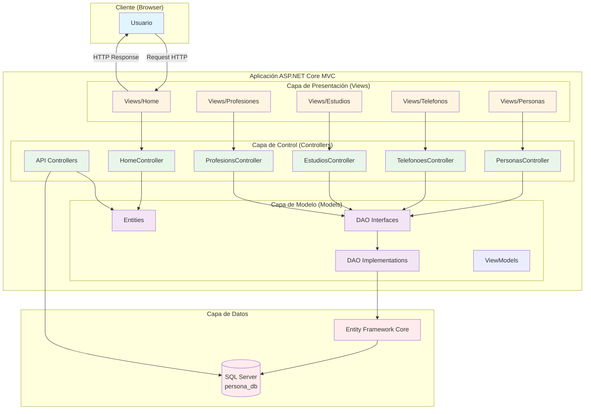
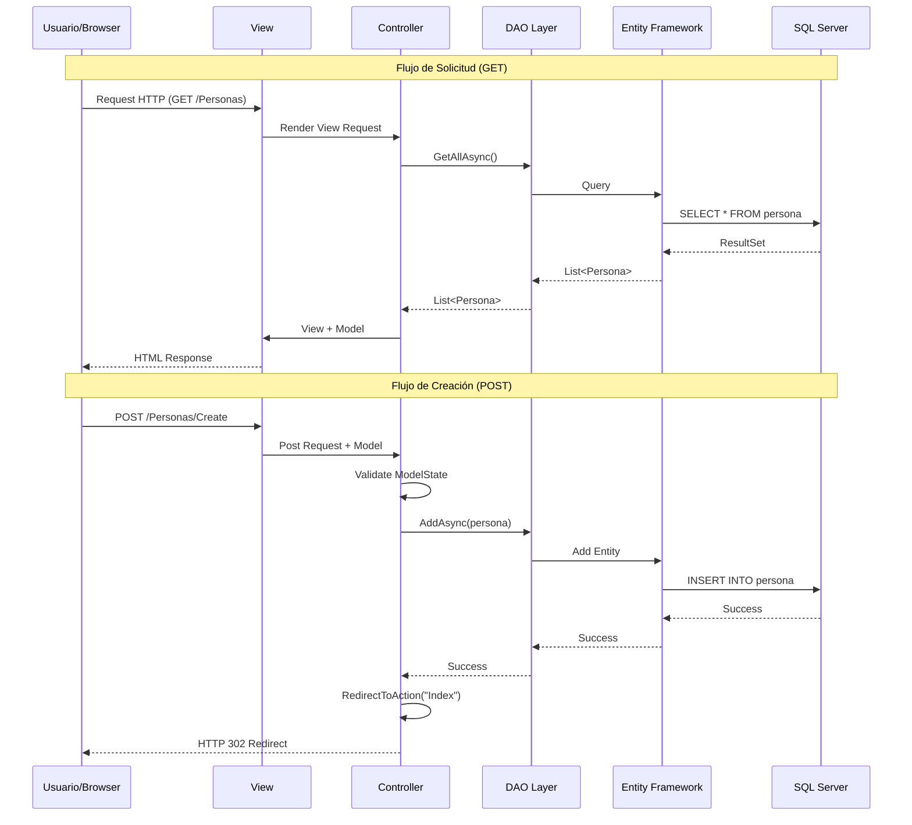
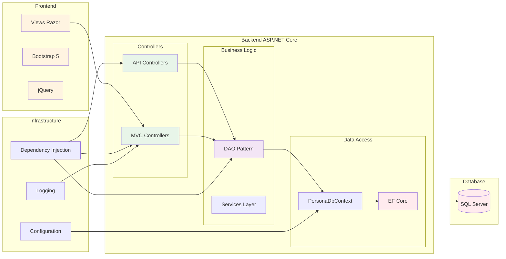
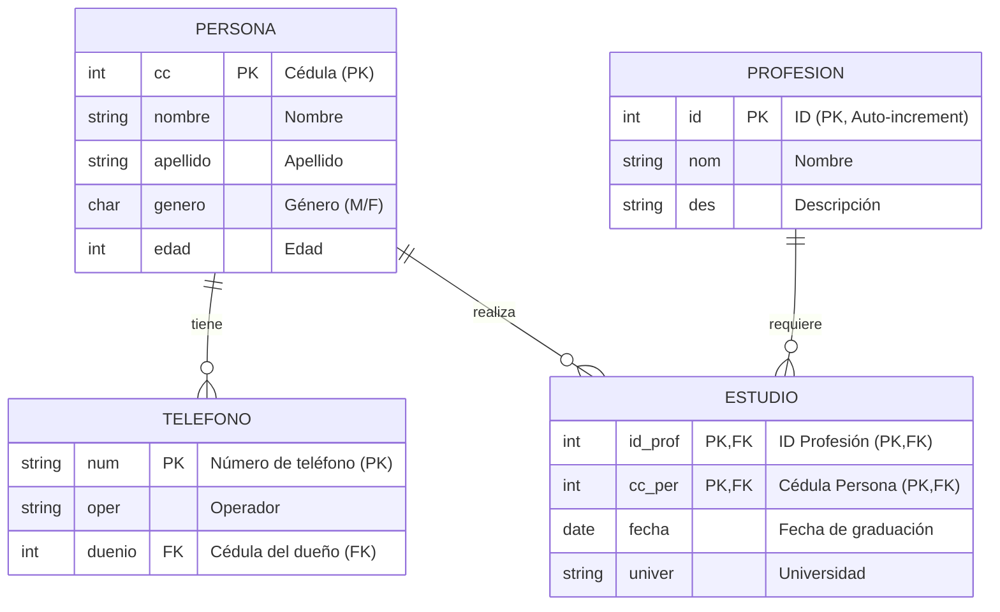

# PersonAPI .NET - Sistema de Gestión de Personas

## 📋 Descripción del Proyecto

**PersonAPI .NET** es una aplicación web académica desarrollada en **ASP.NET Core 8.0** que implementa un sistema completo de gestión de información de personas, incluyendo sus datos personales, teléfonos, profesiones y estudios académicos.

La aplicación sigue el patrón arquitectónico **MVC (Model-View-Controller)** y utiliza **Entity Framework Core** como ORM para la persistencia de datos en **SQL Server**. Además, incluye una **API REST** documentada con Swagger para acceso programático a los recursos.

### Características Principales

- ✅ Gestión completa de CRUD (Create, Read, Update, Delete) para todas las entidades
- ✅ Interfaz web con Bootstrap 5
- ✅ API REST con documentación Swagger
- ✅ Arquitectura en capas con patrón DAO (Data Access Object)
- ✅ Inyección de dependencias
- ✅ Contenedorización con Docker y Docker Compose
- ✅ Base de datos SQL Server con inicialización automática

---

## 🏗️ Arquitectura del Proyecto

### Patrón MVC (Model-View-Controller)

La aplicación implementa el patrón arquitectónico MVC, que separa la aplicación en tres componentes principales:



### Flujo de Datos en el Patrón MVC



### Diagrama de Componentes



---

## 📊 Modelo de Datos

### Diagrama Entidad-Relación (ER)



### Estructura de Tablas

#### Tabla: `persona`
| Campo | Tipo | Restricciones | Descripción |
|-------|------|---------------|-------------|
| `cc` | INT | PRIMARY KEY, NOT NULL | Cédula de ciudadanía (identificador único) |
| `nombre` | VARCHAR(45) | NOT NULL | Nombre de la persona |
| `apellido` | VARCHAR(45) | NOT NULL | Apellido de la persona |
| `genero` | CHAR(1) | NOT NULL, CHECK (M/F) | Género (M=Masculino, F=Femenino) |
| `edad` | INT | NULL | Edad de la persona |

#### Tabla: `profesion`
| Campo | Tipo | Restricciones | Descripción |
|-------|------|---------------|-------------|
| `id` | INT | PRIMARY KEY, IDENTITY | Identificador único de la profesión |
| `nom` | VARCHAR(90) | NOT NULL | Nombre de la profesión |
| `des` | NVARCHAR(MAX) | NULL | Descripción detallada de la profesión |

#### Tabla: `telefono`
| Campo | Tipo | Restricciones | Descripción |
|-------|------|---------------|-------------|
| `num` | VARCHAR(15) | PRIMARY KEY, NOT NULL | Número de teléfono |
| `oper` | VARCHAR(45) | NOT NULL | Operador telefónico |
| `duenio` | INT | NOT NULL, FK → persona.cc | Cédula del dueño del teléfono |

#### Tabla: `estudios`
| Campo | Tipo | Restricciones | Descripción |
|-------|------|---------------|-------------|
| `id_prof` | INT | PRIMARY KEY, FK → profesion.id | ID de la profesión |
| `cc_per` | INT | PRIMARY KEY, FK → persona.cc | Cédula de la persona |
| `fecha` | DATE | NULL | Fecha de graduación |
| `univer` | VARCHAR(50) | NULL | Universidad donde se realizó el estudio |

---

## 🛠️ Tecnologías Utilizadas

### Backend
- **.NET 8.0** - Framework de desarrollo
- **ASP.NET Core MVC** - Framework web
- **Entity Framework Core 9.0.10** - ORM para acceso a datos
- **SQL Server** - Sistema de gestión de base de datos
- **Swagger/OpenAPI** - Documentación de API

### Frontend
- **Razor Pages** - Motor de vistas
- **Bootstrap 5** - Framework CSS
- **jQuery 3.x** - Biblioteca JavaScript
- **jQuery Validation** - Validación de formularios

### Infraestructura
- **Docker** - Contenedorización
- **Docker Compose** - Orquestación de contenedores
- **SQL Server Container** - Base de datos en contenedor

### Herramientas de Desarrollo
- **Visual Studio / VS Code** - IDE
- **.NET CLI** - Línea de comandos
- **EF Core Tools** - Herramientas de migración

---

## 📁 Estructura del Proyecto

```
personapi-dotnet/
├── personapi-dotnet/              # Proyecto principal
│   ├── Controllers/              # Controladores MVC y API
│   │   ├── Api/                  # Controladores REST API
│   │   │   ├── PersonasController.cs
│   │   │   ├── TelefonoesController.cs
│   │   │   ├── EstudiosController.cs
│   │   │   └── ProfesionsController.cs
│   │   ├── HomeController.cs     # Controlador principal
│   │   ├── PersonasController.cs
│   │   ├── TelefonoesController.cs
│   │   ├── EstudiosController.cs
│   │   └── ProfesionsController.cs
│   ├── Models/                   # Modelos de datos
│   │   ├── Entities/             # Entidades de dominio
│   │   │   ├── Persona.cs
│   │   │   ├── Telefono.cs
│   │   │   ├── Estudio.cs
│   │   │   ├── Profesion.cs
│   │   │   └── PersonaDbContext.cs
│   │   ├── DAO/                   # Patrón Data Access Object
│   │   │   ├── Interfaces/       # Interfaces de DAO
│   │   │   │   ├── IPersonaDAO.cs
│   │   │   │   ├── ITelefonoDAO.cs
│   │   │   │   ├── IEstudioDAO.cs
│   │   │   │   └── IProfesionDAO.cs
│   │   │   └── Implementations/  # Implementaciones de DAO
│   │   │       ├── PersonaDAO.cs
│   │   │       ├── TelefonoDAO.cs
│   │   │       ├── EstudioDAO.cs
│   │   │       └── ProfesionDAO.cs
│   │   └── ErrorViewModel.cs
│   ├── Views/                     # Vistas Razor
│   │   ├── Home/
│   │   ├── Personas/
│   │   ├── Telefonoes/
│   │   ├── Estudios/
│   │   ├── Profesions/
│   │   └── Shared/
│   ├── wwwroot/                   # Archivos estáticos
│   │   ├── css/
│   │   ├── js/
│   │   └── lib/                   # Librerías (Bootstrap, jQuery)
│   ├── Properties/
│   │   └── launchSettings.json
│   ├── Program.cs                 # Punto de entrada de la aplicación
│   ├── appsettings.json           # Configuración
│   ├── appsettings.Development.json
│   ├── Dockerfile                 # Imagen Docker
│   └── personapi-dotnet.csproj    # Archivo de proyecto
├── scripts/                       # Scripts SQL
│   ├── DDL.sql                    # Data Definition Language
│   ├── DML.sql                    # Data Manipulation Language
│   └── init.sql
├── docker-compose.yml             # Configuración Docker Compose
├── personapi-dotnet.sln           # Solución Visual Studio
└── README.md                      # Este archivo
```

---

## 🔧 Instalación

### Prerrequisitos

Antes de comenzar, asegúrate de tener instalado:

1. **Docker Desktop**
   - Windows/Mac: https://www.docker.com/products/docker-desktop
   - Linux: Instalar Docker Engine y Docker Compose
   - Verifica la instalación:
     ```bash
     docker --version
     docker-compose --version
     ```

2. **VS Code** (opcional, para edición de código)
   - Descarga: https://code.visualstudio.com/
   - Extensiones recomendadas:
     - C# (Microsoft)
     - Docker (Microsoft)

3. **Git** (opcional, para clonar el repositorio)
   - Descarga: https://git-scm.com/downloads

### Instalación con Docker

#### Paso 1: Clonar el Repositorio

```bash
git clone <url-del-repositorio>
cd personapi-dotnet
```

#### Paso 2: Verificar Docker Compose

El archivo `docker-compose.yml` ya está configurado. Verifica que Docker Desktop esté ejecutándose.

#### Paso 3: Construir y Ejecutar Contenedores

```bash
docker-compose up --build
```

Este comando:
- Construye la imagen de la aplicación .NET
- Descarga la imagen de SQL Server
- Crea y configura los contenedores
- Inicializa la base de datos automáticamente
- Ejecuta los scripts DDL y DML

---

## 🚀 Ejecución

### Opción 1: Ejecución con Docker

#### Ejecutar en Primer Plano

```bash
docker-compose up
```

#### Ejecutar en Segundo Plano

```bash
docker-compose up -d
```

#### Verificar Contenedores

```bash
docker-compose ps
```

Deberías ver:
- `personapi_web` - Aplicación web (puerto 5233)
- `sql_server` - Servidor SQL Server (puerto 1433)
- `sql_init` - Inicializador de base de datos (ya completado)

#### Acceder a la Aplicación

- **Aplicación Web**: http://localhost:5233
- **Swagger UI**: http://localhost:5233/swagger
- **SQL Server**: localhost:1433

### Opción 2: Ejecución con VS Code

1. Abre la carpeta `personapi-dotnet` en VS Code
2. Asegúrate de tener Docker Desktop ejecutándose
3. Presiona `F5` o ejecuta "Run and Debug"
4. Selecciona el perfil "Container (Dockerfile)" en `launchSettings.json`
5. La aplicación se ejecutará en el contenedor Docker

### Verificar Funcionamiento

1. Abre tu navegador en http://localhost:5233
2. Deberías ver la página de inicio
3. Navega a las secciones:
   - Personas
   - Teléfonos
   - Estudios
   - Profesiones
4. Accede a Swagger en `/swagger` para probar la API

---

## 📡 API REST Endpoints

La aplicación expone una API REST completa documentada con Swagger. Accede a la documentación en `/swagger` cuando la aplicación esté ejecutándose.

### Base URL

- **Docker**: `http://localhost:5233/api`

### Endpoints Disponibles

#### Personas API (`/api/Personas`)

| Método | Endpoint | Descripción |
|--------|----------|-------------|
| GET | `/api/Personas` | Obtiene todas las personas |
| GET | `/api/Personas/{id}` | Obtiene una persona por cédula |
| POST | `/api/Personas` | Crea una nueva persona |
| PUT | `/api/Personas/{id}` | Actualiza una persona existente |
| DELETE | `/api/Personas/{id}` | Elimina una persona |

**Ejemplo de Request (POST):**
```json
{
  "cc": 1004,
  "nombre": "Carlos",
  "apellido": "García",
  "genero": "M",
  "edad": 25
}
```

#### Teléfonos API (`/api/Telefonoes`)

| Método | Endpoint | Descripción |
|--------|----------|-------------|
| GET | `/api/Telefonoes` | Obtiene todos los teléfonos |
| GET | `/api/Telefonoes/{id}` | Obtiene un teléfono por número |
| POST | `/api/Telefonoes` | Crea un nuevo teléfono |
| PUT | `/api/Telefonoes/{id}` | Actualiza un teléfono existente |
| DELETE | `/api/Telefonoes/{id}` | Elimina un teléfono |

**Ejemplo de Request (POST):**
```json
{
  "num": "3001234567",
  "oper": "Claro",
  "duenio": 1001
}
```

#### Estudios API (`/api/Estudios`)

| Método | Endpoint | Descripción |
|--------|----------|-------------|
| GET | `/api/Estudios` | Obtiene todos los estudios |
| GET | `/api/Estudios/{idProf}/{ccPer}` | Obtiene un estudio específico |
| POST | `/api/Estudios` | Crea un nuevo estudio |
| PUT | `/api/Estudios/{idProf}/{ccPer}` | Actualiza un estudio |
| DELETE | `/api/Estudios/{idProf}/{ccPer}` | Elimina un estudio |

#### Profesiones API (`/api/Profesions`)

| Método | Endpoint | Descripción |
|--------|----------|-------------|
| GET | `/api/Profesions` | Obtiene todas las profesiones |
| GET | `/api/Profesions/{id}` | Obtiene una profesión por ID |
| POST | `/api/Profesions` | Crea una nueva profesión |
| PUT | `/api/Profesions/{id}` | Actualiza una profesión |
| DELETE | `/api/Profesions/{id}` | Elimina una profesión |

### Ejemplos con cURL

```bash
# Obtener todas las personas
curl http://localhost:5233/api/Personas

# Obtener una persona específica
curl http://localhost:5233/api/Personas/1001

# Crear una nueva persona
curl -X POST http://localhost:5233/api/Personas \
  -H "Content-Type: application/json" \
  -d '{"cc":1005,"nombre":"Ana","apellido":"López","genero":"F","edad":28}'

# Actualizar una persona
curl -X PUT http://localhost:5233/api/Personas/1001 \
  -H "Content-Type: application/json" \
  -d '{"cc":1001,"nombre":"Tatiana","apellido":"Vivas","genero":"F","edad":23}'

# Eliminar una persona
curl -X DELETE http://localhost:5233/api/Personas/1001
```

---

## 🚢 Despliegue

### Despliegue con Docker Compose

#### Producción

1. **Modificar configuración de producción:**

   Edita `docker-compose.yml` o crea `docker-compose.prod.yml`:

   ```yaml
   version: "3.9"
   services:
     personapi_web:
       environment:
         ASPNETCORE_ENVIRONMENT: Production
         ConnectionStrings__DefaultConnection: "Server=sql_server,1433;Database=persona_db;User Id=sa;Password=Password123;TrustServerCertificate=True;"
   ```

2. **Construir para producción:**

   ```bash
   docker-compose -f docker-compose.prod.yml build
   ```

3. **Ejecutar en producción:**

   ```bash
   docker-compose -f docker-compose.prod.yml up -d
   ```

#### Variables de Entorno

Para producción, considera usar variables de entorno:

```bash
export SQL_SERVER_PASSWORD=tu_password_seguro
export ASPNETCORE_ENVIRONMENT=Production

docker-compose up -d
```

---

## 🔍 Verificación y Troubleshooting

### Verificar Instalación

```bash
# Verificar .NET SDK
dotnet --version
# Debe mostrar: 8.0.x o superior

# Verificar Docker
docker --version
docker-compose --version

# Verificar conexión a base de datos (con Docker)
docker exec -it sql_server /opt/mssql-tools18/bin/sqlcmd \
  -S localhost -U sa -P Password123 -C \
  -Q "SELECT COUNT(*) FROM persona_db.dbo.persona"
```

### Problemas Comunes

#### 1. Error de Conexión a Base de Datos

**Síntoma:** `Cannot open database "persona_db"`

**Solución:**
- Verifica que SQL Server esté ejecutándose
- Verifica la cadena de conexión en `appsettings.json`
- Asegúrate de que la base de datos existe
- Si usas Docker, espera a que el contenedor `sql_init` termine

#### 2. Puerto Ya en Uso

**Síntoma:** `Address already in use`

**Solución:**
```bash
# Cambiar puerto en docker-compose.yml
ports:
  - "5234:8080"  # Cambiar 5233 a 5234

# O detener el proceso que usa el puerto
# Windows
netstat -ano | findstr :5233
taskkill /PID <PID> /F

# Linux/Mac
lsof -ti:5233 | xargs kill -9
```

#### 3. Error de Migraciones

**Síntoma:** `Unable to create an object of type 'PersonaDbContext'`

**Solución:**
- La aplicación usa `EnsureCreated()` automáticamente
- Si necesitas migraciones manuales:
  ```bash
  dotnet ef migrations add InitialCreate
  dotnet ef database update
  ```

#### 4. Contenedor SQL Server No Inicia

**Síntoma:** Contenedor `sql_server` se reinicia continuamente

**Solución:**
```bash
# Ver logs
docker logs sql_server

# Verificar que la contraseña cumpla requisitos
# Debe tener al menos 8 caracteres, mayúsculas, minúsculas y números
```

---


---

## 📝 Scripts SQL

### DDL.sql

Contiene la definición de esquema de la base de datos:
- Creación de tablas
- Definición de claves primarias y foráneas
- Restricciones y validaciones

### DML.sql

Contiene datos de ejemplo:
- Personas de prueba
- Profesiones
- Estudios
- Teléfonos

---

## 🧪 Testing

### Probar la API con Swagger

1. Accede a http://localhost:5233/swagger
2. Expande cualquier endpoint
3. Haz clic en "Try it out"
4. Completa los parámetros
5. Ejecuta la petición

### Probar la Interfaz Web

1. Navega a http://localhost:5233
2. Prueba las operaciones CRUD en cada sección:
   - Crear una nueva persona
   - Ver detalles
   - Editar información
   - Eliminar registros

---

## 📄 Licencia

Este es un proyecto académico desarrollado con fines educativos.

---

## 👥 Autores

Proyecto desarrollado como ejercicio académico para Arquitectura de Software por Valeria Arenas, Tatiana Vivas y Juan Pablo Cañón

---

## 🔗 Referencias

- [Documentación ASP.NET Core](https://docs.microsoft.com/aspnet/core)
- [Entity Framework Core](https://docs.microsoft.com/ef/core)
- [Docker Documentation](https://docs.docker.com/)
- [SQL Server Documentation](https://docs.microsoft.com/sql/)


